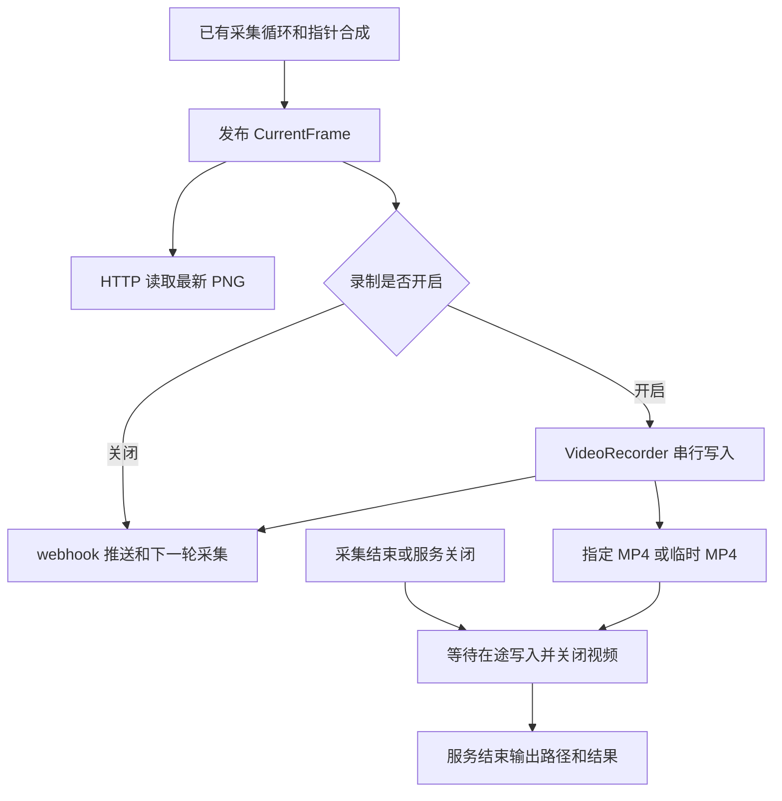

# browscreen 可选视频录制实现方案

编写日期：2026-10-05，Asia/Shanghai。状态：2026-10-05 已审核，作为 0.3.0 的实施依据。

以下正文保留审核时的方案原貌，其中“尚未实施”和验证边界描述的是方案编写时的状态。当前录制行为、安装及操作步骤以[使用说明](../user-guide/使用说明.md#可选视频录制)、[命令行参考](../reference/命令行.md)和[安装与运行](../deployment/安装与运行.md)为准。

本方案拟在现有截图采集流程中增加可选的视频录制能力：只有显式提供 `--record` 时，才加载视频依赖并将成功获取的截图写入 MP4。用户可以指定输出文件；未指定时使用系统临时目录，服务结束后输出文件的绝对路径。本次仅编写方案，参数、依赖和行为均为拟议内容，审核通过后再实施。

建议首版采用 `browscreen[video]` 可选依赖组、PyAV 编码、实际截图时间轴和一个输出文件。复用现有采集循环，视频内容包含已经合成的鼠标指针。录制开启时采用串行写入，减少调度和缓存机制；代价是编码可能降低实际采集频率。

## 需求与成功标准

| 用户要求 | 实施后的验收标准 |
| --- | --- |
| 功能和依赖可选 | 普通安装不安装视频依赖；不传 `--record` 时不导入 PyAV、不创建录制实例、不调用录制方法、不创建输出文件 |
| 将截图数据转为视频 | 复用成功发布的合成 PNG，生成可解码、可播放的 MP4，截图顺序和鼠标指针内容正确 |
| 参数开启录制 | 提供 `--record` 后启用；仅指定输出路径不能隐式开启 |
| 可以指定保存位置 | `--record-output` 接受完整 MP4 文件路径，最终输出归一化后的绝对路径 |
| 默认保存到临时目录 | 未指定输出路径时使用 `tempfile` 创建唯一文件，不硬编码 `/tmp` |
| 运行结束告知位置 | 正常关闭后默认日志级别即可看到结果与绝对路径；无有效帧或录制失败时输出对应结果，不误报成功 |

首版只录制当前截图序列，没有音轨。每次运行最多生成一个视频，不增加实时开关、录制 HTTP API、分段、转码命令、格式选择或独立帧率参数。

## 当前实现基线与接入位置

方案基于项目版本 `0.2.1`、提交 `5fd5744cb46e6fd6b7f9f28d9da424ffe1b3dbaf`。以下事实已通过当前源码核对：

| 位置 | 当前职责 | 拟接入方式 |
| --- | --- | --- |
| [main.py](../../src/browscreen/main.py) | argparse 参数解析、日志配置和单 worker 启动 | 增加录制开关与输出路径参数 |
| [models.py](../../src/browscreen/models.py) | 不可变 `Settings` 和 `CurrentFrame` | 为 `Settings` 增加两个字段；保留现有帧和 HTTP 数据契约 |
| [capture.py](../../src/browscreen/capture.py) | 一个循环负责采集、合成、发布和 webhook 推送 | 在发布完整帧后，按开关调用录制器 |
| [imaging.py](../../src/browscreen/imaging.py) | PNG 校验及鼠标指针合成 | 复用其输出，视频处理放在录制模块内 |
| [app.py](../../src/browscreen/app.py) | FastAPI lifespan、任务取消及资源清理 | 条件创建录制器，负责收尾和退出摘要 |
| [pyproject.toml](../../pyproject.toml) | Python `>=3.14`、基础依赖及唯一项目版本 | 新增 `video` extra，不向基础依赖加入视频库 |

目前截图失败或浏览器失效会清空最新帧，恢复预算覆盖首个有效 PNG；采集等待超时后 HTTP 服务仍可继续提供不可用响应。录制需要分别处理“采集任务结束”和“整个服务结束”。已有 `.mouse` 清空、`.cdp` 保留及外部浏览器的资源归属继续沿用当前约定。



## 参数与用户操作

| 参数 | Settings 字段 | 默认值 | 拟定行为 |
| --- | --- | --- | --- |
| `--record` | `record: bool` | `False` | 显式开启录制 |
| `--record-output PATH` | `record_output: Path \| None` | `None` | 指定完整文件路径；必须同时提供 `--record` |

参数校验放在 `Settings` 中，CLI 沿用项目的配置错误处理：

- 单独提供 `--record-output` 报配置错误，以退出码 `2` 结束。
- 指定文件仅支持 `.mp4` 后缀，大小写不敏感；传入目录或其他后缀报配置错误。
- 展开 `~`，相对路径相对于进程启动目录解析，再转为绝对路径；`--work-dir` 仍只表示文件交换目录。
- 指定路径的父目录必须已存在；首版不自动创建目录，也不覆盖已有文件。
- `--help`、`version` 和 `--version` 继续直接返回，不检查视频依赖或创建录制文件。

审核通过并实施后，源码环境中的安装与使用示例如下：

```sh
# 安装基础功能，不安装视频依赖
uv sync --group dev \
  -i http://mirrors.aliyun.com/pypi/simple/ \
  --trusted-host mirrors.aliyun.com

# 安装视频可选依赖
uv sync --group dev --extra video \
  -i http://mirrors.aliyun.com/pypi/simple/ \
  --trusted-host mirrors.aliyun.com

# 开启录制，使用系统临时目录
uv run --no-sync browscreen --work-dir /absolute/path/to/workspace --record

# 开启录制，指定完整文件路径，父目录需提前创建
uv run --no-sync browscreen --work-dir /absolute/path/to/workspace \
  --record --record-output /absolute/path/to/recordings/session.mp4
```

发布后的普通安装仍使用 `browscreen`；需要录制的用户安装 `browscreen[video]`。运行示例使用 `--no-sync`，直接使用已同步的项目 `.venv`。

## 可选依赖与视频格式

建议使用 PyAV，候选声明如下；最终约束由实施阶段的 Python 3.14 安装和编码验证确定：

```toml
[project.optional-dependencies]
video = ["av>=19.0.1,<20"]
```

PyAV 提供视频帧、编码与封装接口，也提供从 Pillow 图像构造 `VideoFrame` 的接口。拟复用已经安装的 Pillow，通过 `VideoFrame.from_image()` 接入，避免另加 NumPy 或图像处理库。依据：[PyAV 视频接口](https://pyav.basswood.io/docs/stable/api/video.html)、[v19.0.1 帧实现](https://github.com/PyAV-Org/PyAV/blob/v19.0.1/av/video/frame.py)。

[PyAV 19.0.1 的官方包页面](https://pypi.org/project/av/19.0.1/)说明常见平台的二进制 wheel 包含 FFmpeg 库，发布文件中也列出了 macOS、Linux、Windows 的发行物。安装匹配 wheel 时无需另装系统 FFmpeg 命令；目标平台、镜像同步情况及 `libx264` 是否实际可用，仍需实施时验证，不能据此宣称已经在本项目通过。

| 方案 | 与本需求相关的取舍 |
| --- | --- |
| PyAV，建议采用 | 可以直接管理帧时间戳、编码和 MP4 收尾；适合实际采样时间不均匀的截图序列，但需要处理时间基和最后一帧时长 |
| imageio-ffmpeg | `write_frames()` 提供按 `fps` 写入字节帧的便捷接口；若保留实际时间，需要补帧或增加其他时间轴处理，并管理 FFmpeg 子进程 |

上述对 imageio-ffmpeg 的接口描述依据其[官方项目文档](https://github.com/imageio/imageio-ffmpeg)，取舍为本方案的设计判断。首版只实现一种后端，不增加录制器注册表或多后端选择参数。

视频格式拟固定为 MP4、H.264 软件编码器 `libx264`、像素格式 `yuv420p`，没有音轨。基础安装保持原有依赖集合；只有开启录制的启动分支才导入录制模块并加载 `av`。不在模块顶层、版本查询、普通配置校验或普通服务启动时导入 `av`。

## 时间轴与画面尺寸

### 按实际采样时间播放

每张成功截图沿用采集循环本轮的单调时钟起点 `started`，单独传给录制器。`CurrentFrame.capture_started_at` 保留原来的 UTC 文本时间；视频时间不通过解析该文本计算，也不受系统时间调整影响。

第一张有效截图作为视频的零点，启动时等待浏览器的空白时间不录入。后续帧使用相对零点的实际采样时间设置显示时间戳 PTS；`--interval-ms` 继续控制采集目标间隔，并提供名义帧率参考，不增加 `--record-fps`。

例如，默认间隔为 300 毫秒，但三个有效帧实际产生于 `0.0`、`0.3`、`1.2` 秒，视频应在这些时刻切换画面。不能仅把三帧按固定 `1000 / 300` 帧每秒写入，导致慢采集或 webhook 等待被压缩。

实施时拟使用毫秒时间基，将单调时钟差值换算为严格递增的 PTS；同一毫秒内的时间戳按至少一个时间基单位推进。录制器保留一张待编码帧，下一张到达时确定上一张的展示时长；结束时使用采集停止时间确定最后一张的时长，至少为一个时间基单位。需要明确处理编码后数据包的 duration 和时间基换算，避免单帧视频时长为零或最后一帧提前结束。PyAV 说明编码器与容器存在不同的时间基，写入文件头后流时间基还可能变化，依据见[时间接口说明](https://pyav.basswood.io/docs/stable/api/time.html)。

浏览器暂时断开时，视频保留上一张已获取画面，直到恢复帧到达；整个间隔保留在时间轴中。停止采集后不继续延长视频，以免把 HTTP 服务剩余的等待时间计入。视频中的停留画面只代表最后一次成功采样，不表示断线期间网页没有变化；已有截图接口仍按原逻辑返回不可用状态。

### 一个视频使用固定画布

视频以第一张有效 PNG 的实际像素尺寸确定画布，宽高向上补齐至偶数；例如 `1279×719` 对应 `1280×720`，首帧保持原尺寸，在右侧和底部补黑边。使用 PNG 尺寸，不使用 CSS 视口尺寸。

后续截图尺寸相同时直接放入画布；截图尺寸变化时等比例缩放并居中放入固定画布，剩余区域补黑边，不裁剪内容或拉伸比例。尺寸标准化只作用于视频副本，原 PNG、指针位置和 HTTP 图片尺寸仍由原流程决定。

这样可以在浏览器调整窗口、改变缩放或恢复至不同视口时继续写同一个文件。代价是首帧较小时，后续大画面会缩小；若要求每个尺寸都保留原始分辨率，需要改为按尺寸分段，属于另一种方案。PyAV 的[容器说明](https://pyav.basswood.io/docs/stable/api/container.html)要求在首次封装前确定流的结构属性，本方案因此不在运行中修改视频流尺寸。

## 文件创建与结果输出

开启录制后，在 lifespan 启动阶段完成依赖和编码器检查，再准备输出文件：

1. 指定路径时，以排他创建方式打开文件，例如 `open(mode="xb")`；不能只先检查存在性再按覆盖模式打开。保留文件句柄，交给 MP4 封装逻辑，避免覆盖或并发抢占同一路径。
2. 未指定路径时使用 `tempfile.mkstemp(prefix="browscreen-recording-", suffix=".mp4")`，采用系统临时目录和唯一名称，保留句柄及绝对路径。
3. 先预留文件，第一张有效截图到达后才确定尺寸并初始化视频流；不把每一张 PNG 写成中间磁盘文件。
4. 正常生成的视频在退出后保留。默认临时文件不随 Python 上下文自动删除，用户可以按输出路径获取；操作系统之后可能清理临时目录，需长期保存时应指定路径。
5. 全程没有有效帧时关闭句柄并删除本次创建的空占位文件，输出“未生成视频：未获取到有效截图”。仅删除本实例拥有的空占位文件。

最终结果通过现有日志输出到标准错误，默认 INFO 模式可见，无需开启 `-v`。服务启动时可以记录目标路径；服务结束时只输出一次结果摘要。拟定格式如下，路径仅为示例，不能作为实际运行结果：

```text
录制完成，视频文件：/absolute/path/to/recordings/session.mp4
未生成视频：未获取到有效截图
录制提前终止，已保存部分视频：/absolute/path/to/recordings/session.mp4；原因：……
录制失败，残留文件可能无法播放：/absolute/path/to/recordings/session.mp4；原因：……
```

只有至少一帧成功写入，且编码 flush、MP4 关闭和底层文件关闭全部成功，才允许报告录制完成。先发生录制错误后成功收尾的文件报告为部分视频；收尾失败时报告残留文件及错误，不自动删除可能有用的数据。

## 模块与生命周期

新增 `src/browscreen/recording.py`，集中负责视频依赖加载、文件管理、尺寸标准化、时间轴、串行编码及收尾。采用一个具体的 `VideoRecorder`，不新增通用插件层。对采集和应用提供准备、追加完整帧、结束录制及读取结果的最小接口，调用使用关键字参数。

`CaptureService` 增加可选录制器引用，默认 `None`。成功构造并发布 `CurrentFrame` 后，如果存在录制器，传入同一份 PNG 与本轮采样时间，再沿用 webhook 推送和间隔等待。录制关闭时只经过条件分支，不创建编码任务或文件。

PNG 解码、编码和文件写入使用 `asyncio.to_thread()`，同一录制实例最多一个在途操作，追加操作逐次等待完成，不增加帧队列。录制器只保留决定展示时长所需的待编码帧，不累计整段截图。线程执行期间 HTTP 可以继续处理请求；录制开启时编码耗时会延长每轮采集，并可能推迟该帧的 webhook 推送，这是首版明确接受的取舍。

生命周期顺序拟定如下：

1. lifespan 仅在 `settings.record` 为真时构造并准备录制器；准备失败就终止启动，释放已创建的文件及资源。
2. 录制器注入现有采集服务；整个实例仍只有一个采集任务。
3. 采集正常结束、等待超时或未预期异常时，在任务的 `finally` 中记录停止时间并收尾视频；HTTP 服务继续遵循现有状态行为。
4. 服务正常停止、收到 SIGINT 或 SIGTERM 时，先取消并等待采集任务，等待其视频收尾，再执行浏览器断开、HTTP 客户端关闭和 `.mouse` 清空。
5. lifespan 的清理分支兜底结束录制，结束方法必须幂等；最后输出一次结果摘要。录制清理失败不能跳过已有资源清理。

`asyncio.to_thread()` 的等待被取消，不代表后台线程已经停止。录制器必须保留在途任务引用；收尾先等待该操作结束，再 flush 编码器、关闭 MP4 和文件，避免写入与关闭并发发生。此处不能通过简单取消任务并立即关闭句柄实现。

SIGKILL、断电、进程崩溃或连续强制中断无法保证执行收尾及输出路径，也无法保证普通 MP4 可播放。本版覆盖正常退出和优雅信号关闭；需要强制终止后的可靠恢复时，应另行评估分段或可恢复封装。

## 错误处理

| 场景 | 拟定处理 |
| --- | --- |
| 未开启录制，环境没有 `av` | 正常使用现有全部功能 |
| 参数组合或输出路径形式错误 | 配置错误，CLI 退出码 `2` |
| 开启录制但缺少依赖 | 启动失败，明确提示安装 `browscreen[video]`，不自动安装 |
| 编码器不可用、文件已存在或文件无法创建 | 启动失败，输出具体原因及目标路径，不降级为未录制启动 |
| 浏览器断线并恢复 | 沿用截图恢复机制；恢复后继续同一视频并保留经过的时间 |
| 首帧前等待超时 | 沿用 HTTP 不可用响应；结束空录制，删除空占位文件 |
| 已有帧后采集超时或任务异常 | 收尾已有视频，记录采集停止原因；服务退出摘要说明录制随采集提前结束 |
| 运行中 PNG 处理、编码或磁盘写入失败 | 停止录制并尝试收尾；截图、HTTP 和 webhook 继续运行，默认日志立即报告错误；本次运行不自动重启录制 |
| 视频 flush 或关闭失败 | 保存失败结果与残留路径，继续其余资源清理；不报告录制完成 |

录制异常在独立分支内处理，不转换为 `BrowserAdapterError`，不触发浏览器重连，也不清空已经发布的截图。首版通过错误日志和退出摘要表达运行中录制失败，不新增 HTTP 状态字段，也不改变原服务的运行中退出码策略。

## 实施步骤与验证

### 依赖与编码能力验证

先在项目根目录 `.venv` 中通过 uv 验证候选 extra，并锁定可用版本。使用指定镜像源；若镜像暂未同步匹配 wheel，先记录实际限制再调整候选约束，不把来源未验证的版本写成既定可用依赖。

在业务接入前，用固定 PNG 和受控时间生成包含单帧及不等间隔多帧的 MP4。重新打开视频，检查可解码帧数、PTS、duration、尺寸、H.264 和最后一帧展示时长，并用本机播放器检查可播放性。此验证同时确认 Python 3.14、Pillow 接入、`libx264` 和文件句柄封装能够配合工作。

### 参数与录制器实现

修改 `main.py`、`models.py`、`pyproject.toml` 和 `uv.lock`，新增录制模块及针对参数、路径、时间轴、尺寸、文件收尾的 pytest 用例。普通安装的测试使用替身验证开关隔离；真实编码测试只在安装 extra 的环境中运行。

### 接入与退出验证

接入 `capture.py` 和 `app.py`，验证开启录制时复用同一帧、关闭时无录制调用、错误隔离和取消期间的写入顺序。运行已有回归测试，确认恢复预算、截图接口、指针、webhook、日志及退出清理仍符合当前约定。

| 验证对象 | 必须覆盖的证据 |
| --- | --- |
| 开关隔离 | 基础安装环境中没有 `av`；普通启动、截图、帮助、版本查询正常；禁止 `av` 导入的测试通过；没有录制文件或录制器调用 |
| 参数与路径 | 开关组合、相对路径、`~`、错误后缀、目录路径、父目录不存在、已有文件和权限错误；排他创建失败时原文件内容不变 |
| 默认临时文件 | 在受控系统临时目录中创建唯一 MP4；两个实例不冲突；退出后文件仍存在，摘要中的绝对路径与实际文件一致 |
| 内容与时序 | 已知色块和指针位置在解码帧中可确认；顺序正确；`0.0`、`0.3`、`1.2` 秒等非均匀采样时间保留；单帧与最后一帧 duration 非零，总时长与采集停止时间吻合，允许容器时间基舍入误差 |
| 尺寸变化 | 奇数尺寸补边正确；不同宽高比、放大及缩小后的内容完整、比例正确；原截图接口尺寸不变 |
| 资源与错误 | 写入进行中收到取消时，关闭发生在写入完成之后；结束方法可重复调用；模拟写入、flush、关闭失败时继续其他清理；零帧删除空占位文件 |
| 真实浏览器 | 本机 Chrome 录制动态页面和指针变化，调整视口，模拟断开及恢复；确认预览和 webhook 可用，视频没有异常加速 |
| 真实退出 | 分别通过 SIGINT 和 SIGTERM 退出；获取实际视频并播放，检查结束摘要、`.mouse` 清空、`.cdp` 保留和 Chrome 继续运行；另测采集超时先收尾而 HTTP 尚在运行的情况 |

完整录制验收必须在启用了 extra 的环境中执行真实编码测试，不能以跳过这些测试后的结果作为通过依据。基于有损 H.264 的内容断言使用色块、区域或容差，不能要求解码像素与原 PNG 字节完全相同。证据保存到本地 `local/`，遵循当前忽略规则。

### 使用文档与版本交付

实现完成后同步更新中英文 README、安装与运行、命令行和使用说明，解释 extra、两个参数、临时文件保留及正常退出取文件的流程。本方案保留为审核时的设计记录，实际使用行为以实施后的命令和使用文档为准。

这是兼容的新功能，建议在合适的版本提交中升至 `0.3.0`，同步 `pyproject.toml`、`uv.lock` 和中文 `changelog.md`，验证并提交后为该提交创建附注标签 `v0.3.0`，日期取实际环境。当前方案阶段不升版、不改依赖、不创建版本标签；远程推送和发布按后续授权执行。

## 审核重点与验证边界

本次已完成源码接入位置和官方依赖接口查证，尚未安装候选视频依赖、编写录制代码或执行编码验收。以下为影响用户结果的建议，需随本方案一起审核：

| 决策 | 当前建议 | 如需改变的影响 |
| --- | --- | --- |
| 输出格式和依赖 | `video` extra、PyAV、MP4 H.264 | 更换后端需重做安装、时间轴和退出验证 |
| 输出位置参数 | 完整文件路径；父目录已存在；拒绝覆盖 | 若参数改为目录，需要新增文件命名规则 |
| 视频时间轴 | 保留实际采样时间；断线时停留在上一帧 | 若去掉断线时长，视频将只表达有效截图序列的压缩过程 |
| 画面尺寸变化 | 首帧固定画布，后续等比例适配 | 若必须保留每帧原分辨率，需要按尺寸分段并输出多个文件 |
| 编码调度 | 逐帧等待，不积压、不主动丢帧 | 若要求编码不影响采集，需要增加有界队列和积压处理策略 |
| 运行中录制失败 | 停止录制并明确报告，截图服务继续 | 若要求整项任务失败即退出，需要改变服务失败和退出策略 |

实施前以审核意见确定最终行为，再执行上述步骤和验收。
