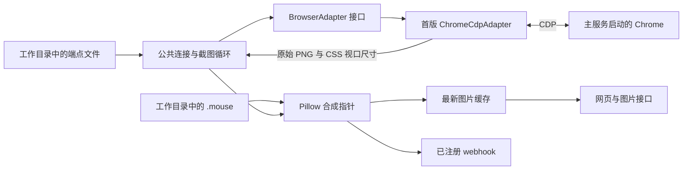

# browscreen 浏览器画面与鼠标指针预览设计方案

初稿日期：2026-10-01；补充日期：2026-10-02，Asia/Shanghai。本方案覆盖用户提出的六项功能，以及已确认的 browscreen 命名、浏览器适配器、退出清空坐标和主服务集成约定。

状态：已实施并完成验收。初稿背景与实施后的几何校正已区分；实施顺序见[具体实施方案](具体实施方案.md)，逐项结果见[阶段核验清单](阶段核验清单.md)，实际证据见[本机验收记录](../project/本机验收记录.md)。

## 一、最小技术结构

项目名称 **browscreen** 来自 `browser`＋`screen`，实际项目根目录为 `/Users/pegasus-yang/Projects/SandBoxProjects/Browscreen/`，Python 包名和启动命令均为 `browscreen`。

**一个 FastAPI 进程负责截图、指针合成、网页展示、图片查询与 webhook 推送。** 浏览器对接通过适配器接口完成；首版 `ChromeCdpAdapter` 直接调用 CDP，不引入自动化框架。页面使用简单 HTML 和 JavaScript。



| 依赖 | 用途 |
| --- | --- |
| Python 3.14 | `asyncio` 调度、文件读取、命令行启动 |
| FastAPI＋Uvicorn | HTTP 服务、应用生命周期、HTML 与图片响应 |
| Pydantic v2 | 校验配置、有限数值坐标和 webhook 注册请求 |
| websockets | 首版 Chrome＋CDP 适配器的协议连接 |
| HTTPX | 首版适配器的 HTTP 端点发现；公共流程的异步 webhook 推送 |
| Pillow | 解码截图、叠加透明指针并输出 PNG |

使用常规 Python 3.14 和 Pydantic v2；依赖版本在实施时通过 `uv` 解析并锁定到 `uv.lock`。当前官方资料已说明 FastAPI 与 Pillow 的 Python 3.14 支持，Pydantic v1 不作为此方案的依赖，依据见第九节。

### 浏览器适配器边界

采用一个 `BrowserAdapter` 接口，可用 Python `typing.Protocol` 声明。公共采集流程按接口调用，每个 browscreen 实例在启动时选定一个适配器；首版选项只有 `chrome-cdp`，对应 `ChromeCdpAdapter`。未知适配器名称在启动配置阶段明确拒绝。

| 接口成员 | 契约 |
| --- | --- |
| `endpoint_file_name` | 端点文件的固定名称；首版为 `.cdp`，公共循环据此从工作目录读取地址 |
| `async connect(endpoint=..., timeout_s=...)` | 校验并连接外部提供的端点，完成可截图页面的选择；预算内成功或抛出统一错误 |
| `async capture_viewport(timeout_s=...)` | 在预算内返回当前视口的 `BrowserScreenshot`，图片尚未绘制本服务的指针 |
| `async disconnect()` | 释放适配器自身的连接和调试会话；未连接时也可调用，保留目标浏览器与页面 |

`BrowserScreenshot` 包含 `png_bytes`、`css_viewport_width`、`css_viewport_height`。PNG 必须是与所报告 CSS 视口对应的有效图片，CSS 尺寸必须为正且有限。外部坐标统一使用该视口左上角为原点的 CSS 像素；不同浏览器或协议的原始尺寸单位，由适配器转换到这个共同契约。

适配器内部的连接、协议、页面失效及截图错误统一为 `BrowserAdapterError`，由公共流程进入等待或重连；底层诊断信息保留在日志中。PNG 合成、帧编号、缓存、HTTP、webhook 和 `.mouse` 退出清空均由公共服务负责，CDP 命令、`targetId` 和 `sessionId` 不进入公共截图数据模型。

首版 `.cdp` 地址校验、`/json/version` 发现、目标附着、CSS 度量和截图命令全部属于 `ChromeCdpAdapter`。公共循环只做文件读取、等待与重试调度，适配器负责解释端点内容。断开适配器只释放连接，`.mouse` 的清空仍只在整个服务退出时执行。

后续支持其他浏览器或协议时，新增符合该契约的适配器，在启动选择处登记名称及构造方式，并完成相同契约测试；公共截图、指针、网页、图片接口及 webhook 流程保持复用。当前已实现接口和 Chrome＋CDP，不创建其他适配器占位实现或动态插件加载机制。

### 主服务与本服务的职责

本服务通过 `browscreen` 命令行入口由主服务作为附属进程启动。每个实例接收主服务提供的适配器、工作目录和 HTTP 监听参数；首版连接 `.cdp` 中指定的浏览器。

| 职责 | 负责方 |
| --- | --- |
| 浏览器启动与关闭、页面访问、浏览器参数与 CDP 端口 | 主服务 |
| 浏览器数据目录、并行环境隔离、工作目录及预览端口分配 | 主服务 |
| 写入或更新 `.cdp`、刷新或清空运行中的 `.mouse` | 主服务或其外部自动化组件 |
| CDP 连接、等待与重连、截图、指针合成、网页、图片接口和 webhook | 本服务 |
| 本服务退出时清空其工作目录内的 `.mouse` | 本服务 |

主服务负责配对目录、浏览器和预览实例。本服务按已提供的参数运行，浏览器多开与环境隔离不作为本服务的管理功能。

## 二、启动配置与运行约定

启动形式如下：

```sh
uv run browscreen \
  --work-dir /absolute/path/to/workspace \
  --adapter chrome-cdp \
  --interval-ms 300 \
  --connect-wait-timeout-s 60 \
  --host 127.0.0.1 \
  --port 8000
```

| 参数 | 默认值 | 行为 |
| --- | --- | --- |
| `--work-dir` | 必填 | 启动时解析为绝对路径；目录不存在或不是目录时启动失败 |
| `--adapter` | `chrome-cdp` | 首版唯一支持项；启动时选择并创建适配器 |
| `--interval-ms` | `300` | 大于零；既作为截图目标间隔，也作为端点文件重试间隔 |
| `--connect-wait-timeout-s` | `60` | 大于零；限定一轮文件等待、连接及目标选择的总时间 |
| `--host` | `127.0.0.1` | 网页与 API 的监听地址 |
| `--port` | `8000` | HTTP 监听端口 |

适配器的一次连接或视口截图操作使用 5 秒总预算；处于等待阶段时，连接预算还须受该轮剩余等待时间限制。Chrome＋CDP 适配器的内部请求共用本次操作的剩余预算，不能通过多条命令延长总时间。webhook 发送使用 3 秒的总截止时间。先保留这些内部默认值，不另增加一批配置项。

等待参数采用 `--connect-wait-timeout-s`，公共错误码也采用浏览器通用命名，便于后续协议复用。首版端点文件仍保持 `.cdp`，鼠标文件仍保持 `.mouse`。

服务使用一个 Uvicorn worker。缓存、注册记录和截图循环都属于同一个进程，多 worker 会导致重复采集及注册记录不一致。

FastAPI `lifespan` 创建选定适配器并启动一个截图后台任务后即开始提供 HTTP 服务。即使 `.cdp` 尚未写入，用户也能打开网页查看等待状态；服务关闭时停止并等待后台任务结束，调用适配器的 `disconnect()` 并关闭 HTTPX 连接，再按第三节约定清空 `.mouse`。

## 三、工作目录文件协议

### 1. `.cdp`：固定文件名、单行地址

本节是首版 Chrome＋CDP 适配器的端点契约，该适配器的 `endpoint_file_name` 固定为 `.cdp`。

读取 `<work-dir>/.cdp`，不扫描其他 `.cdp` 后缀文件。文件使用 UTF-8，允许 BOM 和末尾换行，去除前后空白后应为一个地址。例如：

```text
http://127.0.0.1:9222
```

支持以下地址形式：

| 形式 | 处理方式 |
| --- | --- |
| `http://host:port` 或 `https://host:port` | 标准 Chrome 调试 HTTP 入口，读取其 `/json/version` 获取浏览器 WebSocket 地址 |
| `ws://…/devtools/browser/…`、`wss://…` 浏览器级端点 | 直接连接，再列出并附着目标页面 |
| `ws://…/devtools/page/…`、`wss://…/devtools/page/…` 页面端点 | 直接连接指定页面，在该连接上调用截图命令 |

多行地址、格式不合法、文件不存在、内容为空或本轮无法读取，均视为尚未获得可用配置；按重试间隔继续读取。即使地址格式正确，也必须成功连接并取得可截图的页面才结束等待。

HTTP 入口发现出的 WebSocket 地址必须可被当前服务访问；该简单方案直接使用浏览器返回的地址，不自动猜测代理或容器端口映射。需要这些环境时，可在 `.cdp` 中填写实际可达的 WebSocket URL。

### 2. `.mouse`：固定文件名、一个坐标对

读取 `<work-dir>/.mouse`，格式为文本 `x,y`：

```text
320,180
```

允许空格、小数及末尾换行，例如 `320.5, 180.0`。解析后通过 Pydantic 的有限浮点数校验，拒绝 `NaN`、无穷值及多余字段。

**坐标使用主框架当前视口的 CSS 像素，原点是视口左上角。** 它不是整个文档的滚动坐标，也不是桌面屏幕坐标；写入方必须提供实际滚动后的鼠标位置。

| 文件情况 | 下一张截图的指针 |
| --- | --- |
| 有效坐标，落在视口内 | 绘制指针 |
| 不存在、为空、无法读取或解析失败 | 不绘制指针 |
| 坐标在视口外 | 不绘制指针 |

每轮截图开始时重新读取，不沿用上一轮坐标。因此，删除或清空 `.mouse` 后，下一轮读取该文件所生成的新帧即移除指针；已经开始处理的上一帧可能仍含原坐标。写入方可采用临时文件加原子替换，减少读取到半个坐标对的情况。

运行期间由外部系统控制坐标刷新。本服务保持 `x,y` 文件格式，只按每轮读到的内容和视口范围决定是否绘制；文件中的有效坐标即使长时间未更新，也继续显示。不引入坐标有效期、心跳、租约或运行标识。

### 3. 服务退出时清空 `.mouse`

正常停止或优雅退出时，将 `<work-dir>/.mouse` 的已有文件内容截断为零字节，保留文件本身。文件不存在时无需创建；清空仅针对当前实例的工作目录，不修改 `.cdp`。

清空放在整个服务的退出清理流程中：先停止并等待采集任务结束，释放自身连接，然后执行文件清空。其他资源清理失败时仍须尝试清空；清空失败应记录文件路径与原因，不能报告为清空成功。文件权限须允许本服务清空内容。

CDP 断线、重新连接或等待超时但 HTTP 服务仍运行时，不清空 `.mouse`；此时坐标继续由外部系统控制。启动时也不主动清空文件。主服务停止坐标写入后，以正常停止或优雅退出方式结束预览进程，并等待其退出完成。

强制杀进程或设备断电无法执行退出清理；本方案不增加额外恢复机制。

## 四、适配器等待、截图与重连

### 1. 等待和连接

启动后进入 `waiting` 状态，并记录基于单调时钟的 60 秒截止时间。公共流程读取适配器指定的端点文件，调用 `connect(endpoint=..., timeout_s=...)`；首版读取 `.cdp`，由 Chrome＋CDP 适配器解析地址、连接浏览器并选择页面。失败时调用 `disconnect()` 释放本次连接，间隔 300 毫秒再次从文件读取。文件内容重复、连接失败和部分写入都不重置本轮截止时间。

Chrome＋CDP 适配器在浏览器级端点使用 `Target.getTargets` 选择返回列表中第一个 `type="page"` 的已有页面，再调用 `Target.attachToTarget`，设置 `flatten: true`。后续页面命令带该调试会话的 `sessionId`。没有页面时连接失败，公共流程继续等待，不主动创建标签页。

该连接期间固定观察选中的页面。多个标签页时，若要精确指定其中一个，推荐由写入方在 `.cdp` 提供对应的页面 WebSocket URL；首版不增加页面选择界面。

### 2. 每轮采集

1. 记录本轮开始时间，读取本轮 `.mouse` 坐标。
2. 公共流程调用适配器的 `capture_viewport(timeout_s=5)`。
3. 首版适配器内部通过 `Runtime.evaluate` 只读获取 `window.innerWidth/innerHeight`，再调用 `Page.captureScreenshot`，返回完整 CSS 视口尺寸与原始 PNG；截图参数为 `format="png"`、`fromSurface=true`、`captureBeyondViewport=false`，不设置 `clip` 或修改浏览器视口。
4. 公共流程解码适配器返回的 PNG 字节；存在有效坐标时合成指针。
5. 生成一个完整帧对象，一次性更新最新图片缓存。
6. 对此时已注册的每个 webhook 并发执行一次推送，并等待结果。
7. 按本轮已耗时补足至 300 毫秒；超过 300 毫秒则直接开始下一轮。

始终只有一轮采集在进行，不补做已经错过的时间点。网页与 API 查询只读取缓存，不会额外调用浏览器截图。

上述 CDP 调用与 Base64 解码封装在 Chrome＋CDP 适配器内部。其协议客户端同时只等待一条命令响应，使用递增命令 `id` 匹配结果；接收过程中跳过其他事件，不能把任意一条 WebSocket 消息当作当前命令响应。浏览器级连接另外携带正确的调试会话 `sessionId`。连接时显式设置 `max_size=None`，避免较大的 Base64 截图触发 websockets 默认消息大小限制；图片不建立累积队列。

### 3. 原地址失效

适配器报告 `BrowserAdapterError` 或操作超时时，调用 `disconnect()`，清空最新图片，重新进入 `waiting`，为本次恢复建立新的截止时间。首版对应 WebSocket 断开、协议请求超时、目标页面关闭或截图命令失败等情况。

**重连必须重新读取选定适配器的端点文件，首版为 `.cdp`，不能只反复连接缓存里的旧地址。** 文件更新为新地址后连接新浏览器；文件仍是同一地址时也重新尝试，允许原调试服务恢复。正在正常工作的连接不因文件改写立即切换，只有进入恢复流程时重新解析配置。重连沿用启动时选定的适配器。

恢复成功后继续采集，webhook 注册记录保留；失败期间不生成图片，也不发送伪造的空图片。服务只关闭自己的连接，不发送 `Browser.close` 或关闭目标标签页的命令。

### 4. 超时

首次等待或重连等待超时后，状态变为 `timed_out`，停止截图和文件轮询。HTTP 服务仍运行，网页显示超时，图片接口返回明确的 `503`。修正文件后重启服务，开始下一轮等待。

这是对“直到读到地址或者超时”的具体约定，避免等待循环自行重置超时而永远运行。

## 五、鼠标指针合成

服务包内置一张透明背景的箭头 PNG，记录其热点位置。使用 Pillow 在原始截图上绘制，每轮都从新截图开始，保证旧指针不留下残影。网页、图片接口与 webhook 因而都得到包含指针的同一张图片。

公共合成逻辑以 `BrowserScreenshot` 返回的 CSS 视口尺寸和 PNG 实际尺寸换算坐标。首版 Chrome＋CDP 适配器在普通桌面页面中以 `window.innerWidth/innerHeight` 填充与完整截图对应的 CSS 尺寸；转换公式为：

```text
图片横坐标 = x × PNG宽度 / CSS视口宽度
图片纵坐标 = y × PNG高度 / CSS视口高度
指针左上角 = 图片坐标取整后 - 指针热点
```

只有 `0 ≤ x < CSS视口宽度` 且 `0 ≤ y < CSS视口高度` 时绘制。指针热点与指针图片采用最终 PNG 像素单位。光标作用点位于边缘时，可以裁掉指针图片超出截图的部分。

例如 CSS 视口为 `1280×720`，PNG 为 `2560×1440`，`.mouse` 写入 `320,180`，则指针热点落在 PNG 的 `(640,360)`。网页用 `` 等比缩放整张图片，指针会随图片保持对齐。

首版按普通桌面页面设计，采集期间保持页面缩放稳定；移动端捏合缩放、特殊视口模拟需另做坐标验证。`.mouse` 仅有坐标，没有动作时间，故这里展示的是截图请求前读到的位置，不保证与捕获瞬间完全一致。

实施时的真实 Chrome 验证发现：默认截图包含滚动条，但原计划的 `cssLayoutViewport.clientWidth` 不包含它，导致坐标比例偏移。`clip` 又会临时调整浏览器视口，可能影响其他 CDP 操作。因此改为只读获取完整窗口视口的 CSS 尺寸，保留原始完整视口 PNG；外部鼠标坐标仍以当前可见视口左上角为原点。这是对共同几何契约的实现校正。Chromium 的截图实现可在[官方源代码](https://chromium.googlesource.com/chromium/src/+/refs/heads/main/content/browser/devtools/protocol/page_handler.cc)核对。

文件读取和 Pillow 合成使用 `asyncio.to_thread` 执行，避免在 HTTP 事件循环中进行图片解码与编码。只有前一帧处理完成后才处理下一帧。

## 六、网页、图片接口与 webhook

### 1. 最小 HTTP 接口

| 方法与路径 | 响应 | 用途 |
| --- | --- | --- |
| `GET /` | `200 text/html` | 只读预览页 |
| `GET /api/screenshot` | `200 image/png`，不可用时 `503 application/json` | 直接读取最新合成图片 |
| `POST /api/webhooks` | 首次注册 `201`，重复注册 `200` | 注册逐帧图片接收地址 |

预览页通过 JavaScript 按配置间隔（默认 300 毫秒）读取图片接口，在上一请求结束后再调度下一请求；页面调整图片显示尺寸时保持比例。成功后替换图像，失败时隐藏旧图并显示等待或超时信息。网页不向浏览器转发鼠标和键盘输入。

图片响应附带 `Cache-Control: no-store`、`X-Frame-Id` 和 `X-Capture-Started-At`。后者是本轮截图请求开始的 UTC 时间，不声称是浏览器渲染发生的精确时间。

没有可用图片时，例如等待 `.cdp`：

```json
{
  "code": "waiting_for_browser",
  "message": "正在等待浏览器端点可用"
}
```

另外使用 `screenshot_not_ready` 表示已连接但首帧尚未产生，`browser_wait_timeout` 表示等待超时。客户端应根据错误码显示状态；这些公共状态不依赖具体浏览器协议。

### 2. webhook 注册

请求示例：

```http
POST /api/webhooks
Content-Type: application/json

{"url":"http://127.0.0.1:9001/on-screenshot"}
```

Pydantic 校验 `url` 为 HTTP(S) 地址。注册成功响应：

```json
{
  "url": "http://127.0.0.1:9001/on-screenshot",
  "registered": true
}
```

地址规范化后去重，相同地址只推送一次。注册不回放历史图片，参与后续新帧；注册记录只在进程内保留，CDP 重连不丢失，服务重启后需重新注册。首版只提供注册接口，注册有效期到进程结束。

### 3. 每张图片直接推送

每生成一张合成 PNG，立即更新本地缓存，并对注册地址列表的快照执行 HTTP `POST`：

- 请求正文：PNG 二进制，不是图片 URL，也不是 Base64 JSON。
- `Content-Type`：`image/png`。
- 图片与 `X-Frame-Id`、`X-Capture-Started-At`：与图片接口一致。
- 所有地址并发发送；每个地址每帧尝试一次，2xx 为成功。
- 请求用 `asyncio.timeout(3)` 限制总耗时，并设置 HTTPX 网络超时；不跟随重定向。
- 超时、连接失败或非 2xx 记日志，不使其他地址的发送失败，不自动重试。

调用方在接收接口中直接读取请求 body，即可取得图片字节。FastAPI 的 OpenAPI webhook 声明只描述契约，实际推送由 HTTPX 执行。

**300 毫秒采样与逐帧推送采用简单的等待策略：本帧所有发送尝试结束后，再进入下一轮截图。** 正常耗时低于 300 毫秒时按目标间隔运行；慢 webhook 会降低采样频率，但不会产生无限后台任务或丢弃已生成帧。这里保证的是每个注册地址都获得发送尝试，不保证失败接收方成功收到图片。

如果必须在 webhook 变慢时仍保持 300 毫秒采样，就需要把采集和发送分离，并规定缓冲容量、积压或磁盘暂存行为。这会增加复杂度，本次最小方案先采用上述等待策略。

## 七、代码组织与数据模型

当前实现按职责组织如下：

```text
src/browscreen/
  main.py                  # 命令行和 Uvicorn 启动
  app.py                   # 适配器创建、生命周期和 HTTP
  capture.py               # 公共等待、采集和完整帧发布
  files.py                 # 文件读取和退出清理
  imaging.py               # PNG 校验和指针合成
  webhooks.py              # 逐帧并发发送
  preview.html             # 只读预览页
  models.py                # Pydantic配置、坐标、注册及错误模型
  adapters/
    __init__.py
    base.py                # BrowserAdapter、BrowserScreenshot与统一错误
    chrome_cdp.py          # ChromeCdpAdapter与内部CDP协议处理
  assets/cursor.png        # 内置透明指针
```

| 模型／内部对象 | 主要字段 |
| --- | --- |
| `Settings` | `work_dir`、`adapter`、`interval_ms`、`connect_wait_timeout_s`、`host`、`port` |
| `BrowserScreenshot` | 原始 `png_bytes`、`css_viewport_width`、`css_viewport_height`，由适配器返回 |
| `MousePosition` | `x`、`y`，使用有限浮点数类型 |
| `WebhookRegistration` | `url`，使用 Pydantic HTTP(S) URL 类型 |
| `ErrorResponse` | `code`、`message` |
| `CurrentFrame` | 帧编号、请求开始时间、PNG 字节；作为完整对象替换缓存 |

API 只取一次 `CurrentFrame` 引用，再用其中的图片和元数据构造响应，避免新旧帧混用。PNG 字节通过 `Response(media_type="image/png")` 返回，不走 JSON 序列化。

`app.py` 根据配置创建 `ChromeCdpAdapter`，将其作为 `BrowserAdapter` 注入 `capture.py`。公共采集代码不导入具体适配器或发送 CDP 命令。首版构造映射只登记 `chrome-cdp`；适配器选择集中在这一处。

Chrome＋CDP 适配器复用生命周期中创建的 HTTPX 客户端完成端点发现，`disconnect()` 只释放适配器自己的 WebSocket 与会话。共享 HTTPX 客户端由应用退出流程关闭，重连时继续用于端点发现和 webhook。

使用 `uv` 管理工程、依赖和根目录 `.venv`，代码按项目打包配置安装；使用完整包导入路径。依赖安装遵循项目指定 PyPI 源参数 `-i http://mirrors.aliyun.com/pypi/simple/ --trusted-host mirrors.aliyun.com`，验证使用该 `.venv` 和 `pytest`。

## 八、实施顺序与验收标准

1. 实现 browscreen 配置、文件读取、适配器契约及 Chrome＋CDP 适配器：用可控文件、模拟协议响应和测试适配器验证等待、超时、目标、命令匹配及公共流程复用。
2. 实现截图和指针合成：用已知图片、坐标和热点验证输出像素位置，并确认坐标失效后指针消失。
3. 接入 FastAPI 生命周期、图片接口和简单网页：验证缓存响应、等待状态和关闭清理。
4. 实现注册与并发推送：用本地接收器记录图片、帧编号和时间，验证每帧发送、失败隔离及慢接收方行为。
5. 在本机启动无头 Chrome 并访问 `https://ceshiren.com`，通过本服务网页检查对应画面和鼠标绘制，完成端到端验收。具体操作和证据要求见[具体实施方案第四节](具体实施方案.md#四本机最终验收操作)。

| 场景 | 成功标准 |
| --- | --- |
| 适配器选择与公共契约 | 默认选择 `chrome-cdp`，未知名称被拒绝；测试适配器无需 CDP 命令即可驱动公共截图、合成和输出流程 |
| `.cdp` 初始缺失或为空，随后写入 | 超时前建立连接，网页与图片接口出现首帧 |
| 地址格式错误、无法连接或没有页面 | 持续重新读文件；到期进入超时，不无限重置计时 |
| 原 CDP 失效，文件写入新地址 | 清除旧图；恢复等待后连接新地址，保留 webhook 注册 |
| 原文件地址未变，原服务恢复 | 同一轮恢复等待内也能重新连接 |
| `.mouse` 有效、变化、删除或写入无效内容 | 下一轮读取后的新帧正确更新位置或不绘制，不残留旧箭头 |
| 外部系统暂时不刷新有效 `.mouse` | 保持按文件中的坐标绘制，不自动过期，不改写文件 |
| PNG 像素尺寸为 CSS 视口两倍 | 热点落在换算后的正确像素，网页缩放后保持对齐 |
| 正常采集，无慢接收方 | 以 300 毫秒为目标调度，前一帧未完成时不会重叠采集 |
| 多个网页或图片接口调用者 | 读取同一缓存；不会按访问次数重复调用 CDP |
| 多个 webhook、重复注册、推送错误 | 每个新帧对各唯一注册地址尝试一次，图片字节一致，错误被记录 |
| webhook 耗时超过 300 毫秒 | 采集降频且每帧仍尝试推送；无图片队列积压 |
| 服务停止 | 释放自身任务和连接，已有 `.mouse` 清空为零字节，`.cdp` 保持原内容，已有浏览器继续运行 |
| 正常停止后同目录重启，外部未写新坐标 | 读取已清空的 `.mouse`，不显示上次指针；外部写入新坐标后正常绘制 |
| 本机无头 Chrome 访问 `https://ceshiren.com` | 必须在本服务预览页看到对应网站的实际页面画面，能够持续更新；空白、浏览器错误页或只拿到图片接口响应均不能判为通过 |
| 在上述真实页面中写入、修改、清空 `.mouse` | 服务页指针热点与换算后的坐标一致，更新后没有残影，清空后消失，图片等比缩放后仍对齐 |

以上标准已按[阶段核验清单](阶段核验清单.md)执行，90 项自动测试、真实 Chrome 预览、指针、恢复和退出重启均通过。具体版本、过程修正和证据见[本机验收记录](../project/本机验收记录.md)。

## 九、实现依据

- [Python Protocol](https://docs.python.org/3.14/library/typing.html#typing.Protocol)：声明浏览器适配器的接口契约；实际行为仍通过契约测试核验。
- [CDP 官方协议定义](https://raw.githubusercontent.com/ChromeDevTools/devtools-protocol/master/json/browser_protocol.json)：截图 Base64 数据、视口参数、CSS 布局度量、目标附着与调试会话。实施时以目标浏览器的实际协议为准。
- [FastAPI lifespan](https://fastapi.tiangolo.com/advanced/events/)：应用生命周期内创建与清理后台资源。
- [FastAPI 自定义响应](https://fastapi.tiangolo.com/advanced/custom-response/)：HTML 页面与 PNG 字节响应。
- [FastAPI 发布说明](https://fastapi.tiangolo.com/release-notes/)与[Pydantic v2 迁移说明](https://fastapi.tiangolo.com/how-to/migrate-from-pydantic-v1-to-pydantic-v2/)：Python 3.14 支持及 Pydantic v1 的支持边界。
- [Pydantic 文档](https://docs.pydantic.dev/latest/)：模型与输入校验。
- [websockets asyncio 客户端](https://websockets.readthedocs.io/en/stable/reference/asyncio/client.html)：CDP WebSocket 连接。
- [HTTPX 异步客户端](https://www.python-httpx.org/async/)：共享 HTTP 客户端与异步请求。
- [Pillow Image](https://pillow.readthedocs.io/en/stable/reference/Image.html)与[Python 支持范围](https://pillow.readthedocs.io/en/stable/installation/python-support.html)：图片处理与 Python 3.14 兼容依据。
- [FastAPI OpenAPI Webhooks](https://fastapi.tiangolo.com/advanced/openapi-webhooks/)：webhook 契约声明与应用自行发送请求的职责区别。
