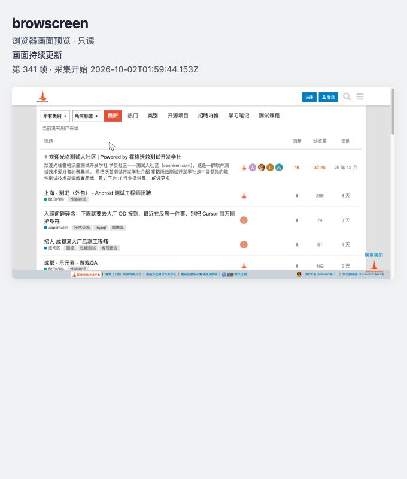

# browscreen 本机验收记录

结论：**通过**。实施七阶段与 49 个核验项均有自动测试、代码审核或真实浏览器证据；完整 pytest 结果为 **90 passed**，无警告。验收使用本机无头 Chrome 访问 `https://ceshiren.com/`，可见浏览器打开 browscreen 服务页，实际显示站点画面及合成指针。

验证环境记录时间：`2026-10-02T10:09:48+08:00`；测试进程与临时目录回收时间：`2026-10-02T10:12:37+08:00`，Asia/Shanghai。记录署名：Pegasus-Yang；自动测试与浏览器核验由 Codex 在本机执行。

## 环境与工程

| 项目 | 实际值 |
| --- | --- |
| 系统 | `macOS-26.6.2-arm64-arm-64bit-Mach-O` |
| Python | `3.14.7`，项目根 `.venv/bin/python` |
| uv | `uv 0.12.21 (Homebrew 2026-09-29 aarch64-apple-darwin)` |
| Chrome | `Chrome/154.0.8037.95` |
| FastAPI／Pydantic | `0.142.2`／`2.13.5` |
| Uvicorn／websockets | `0.54.0`／`17.1` |
| HTTPX／Pillow | `0.28.1`／`12.3.0` |
| pytest／pytest-asyncio | `9.1.1`／`1.4.0` |
| 依赖源与锁定 | 指定阿里云源，实际 [uv.lock](../../uv.lock) |
| 安装包 | `dist/browscreen-0.1.0-py3-none-any.whl`，已检查预览 HTML、透明指针 PNG 及源码完整 |

使用 `uv` 建立 `.venv` 并安装项目；根目录导入与 `browscreen --help` 由测试验证。运行依赖与实际时间见[环境记录](acceptance-evidence/environment.json)，构建输出见[构建记录](acceptance-evidence/build.txt)。

## 实际启动与退出

验收工作目录为 `/private/tmp/browscreen-acceptance-4tf83b8w/work`，Chrome 使用独立数据目录；首个实例的 CDP 为 `http://127.0.0.1:53985`，恢复实例为 `http://127.0.0.1:55677`。服务网页在验收期间为 `http://127.0.0.1:53557/`。这些临时端口和路径用于记录本次执行，进程与目录已回收，复测时应重新创建。

第一台 Chrome 的实际启动命令：

```sh
'/Applications/Google Chrome.app/Contents/MacOS/Google Chrome' \
  --headless \
  --remote-debugging-address=127.0.0.1 \
  --remote-debugging-port=0 \
  --user-data-dir=/private/tmp/browscreen-acceptance-4tf83b8w/chrome-profile \
  --window-size=1280,720 \
  --no-first-run --no-default-browser-check \
  https://ceshiren.com
```

第二台采用相同参数，数据目录改为 `/private/tmp/browscreen-acceptance-4tf83b8w/chrome-profile-recovery`。实际端口从各自的 `DevToolsActivePort` 读取。browscreen 命令：

```sh
.venv/bin/browscreen \
  --work-dir /private/tmp/browscreen-acceptance-4tf83b8w/work \
  --adapter chrome-cdp \
  --interval-ms 300 \
  --connect-wait-timeout-s 60 \
  --host 127.0.0.1 --port 53557
```

分别实际使用 SIGTERM 与 SIGINT 结束服务，确认 `.mouse` 保留且为零字节、`.cdp` 不变，两台 Chrome 仍能响应 `/json/version`。随后由验收准备脚本关闭两台自建 Chrome 并回收临时目录；服务自身只释放 WebSocket 和 HTTP 客户端。详见[运行与回收信息](acceptance-evidence/run.json)、[SIGTERM 记录](acceptance-evidence/exit-sigterm.json)和[SIGINT 记录](acceptance-evidence/exit-sigint.json)。

## 阶段验证与审核

| 阶段 | 结果与验证方式 |
| --- | --- |
| 一 | 通过：配置、固定文件、BOM、有限坐标、未知适配器及命令入口；`test_files_and_settings.py` |
| 二 | 通过：HTTP／浏览器 WS／页面 WS、会话匹配、大消息、连接和截图总预算、错误归一；`test_adapter_contract.py`、`test_chrome_cdp.py` |
| 三 | 通过：固定 PNG 的 1／2 倍热点、四边裁切、移动／移除、无过期、单循环调度和完整帧；`test_capture.py` |
| 四 | 通过：三个无帧状态、PNG 头与缓存、多人查询、线程合成期间 HTTP 响应、关闭清理；`test_http.py` 与真实网页 |
| 五 | 通过：规范化去重、新帧逐地址发送、相同字节及元数据、慢接收器、超时／连接失败／500／重定向隔离；`test_webhooks.py` 与真实接收器 |
| 六 | 通过：端点重读、等待不重置、超时停止、新地址／同地址恢复、注册保留、退出清空和重启；`test_reconnect.py` 与真实 Chrome |
| 七 | 通过：真实网站、31 秒连续采集、指针位置及半宽缩放、退出重启和全量测试；下表 F-01 至 F-09 |

逐项操作标准与审核结论见[阶段核验清单](../design/阶段核验清单.md)。执行 `.venv/bin/python -m pytest -q -W error`，结果 **90 passed in 1.66s**，详见[pytest 原始输出](acceptance-evidence/pytest.txt)。

## 真实网站与指针

| 编号 | 实际结果 | 证据 |
| --- | --- | --- |
| F-01 | 外部启动无头 Chrome，URL 为 `https://ceshiren.com/`，标题与内容识别为爱测测试人社区 | `target-page.json`、Chrome 日志 |
| F-02 | 可见服务网页真实加载目标站点画面；最终 PNG 与 `` 自然尺寸为 `1280×633` | `preview-final.json`、`preview-B.jpg` |
| F-03 | 观察 31.025 秒，连续 103 个不同新帧；间隔 0.300～0.303 秒，平均 0.301667 秒 | `sampling-31s.json` |
| F-04 | A 点 CSS `(320,180)`，对应 PNG 热点 `(320, 180)`，每轴误差 `(0, 0)` 像素 | `mouse-A.json`、`mouse-A.png`、`preview-A.jpg` |
| F-05 | B 点 CSS `(640,360)`，热点 `(640, 360)`，误差 `(0, 0)`；A 点局部与原始截图一致 | `mouse-B.json`、`mouse-B.png`、`preview-B.jpg` |
| F-06 | 清空、`abc`、`NaN,180`、负值及删除文件均移除指针，没有复用旧坐标 | `clear/invalid/nan/outside/missing.json` 与对应 PNG |
| F-07 | 显示宽度由 1280 变为 640，比例 0.5；A 点和整张图共同等比缩放 | `preview-scaling.json`、`preview-half.jpg` |
| F-08 | 正常／优雅退出清空坐标，重启画面与原始截图像素一致；外部再写 B 点后正常合成 | `exit-sigterm.json`、`exit-sigint.json`、`restart-clean.json/png`、`preview-restart-clean.jpg`、`mouse-B.json` |
| F-09 | 90 项测试、安装包资源及阶段审核通过；测试浏览器、服务和临时目录已回收 | `pytest.txt`、`build.txt`、`run.json` |

A 点验证时实际 CSS／PNG 为 `1265×633`，B 点复核使用第二台 Chrome，为 `1280×633`；各 JSON 按该帧自己的几何独立计算，均未用 `--window-size` 代替实际视口。热点为内置 `24×32` 指针图的 `(1,1)`；固定图测试独立验证 1／2 倍比例与四边裁切。真实页面核验局部差异及尖端像素，不将全页动态差异当成指针。

半宽预览证据：



## webhook 与恢复联验

三个真实本地接收器分别正常返回 204、延迟 400 毫秒返回 204、返回 500。首次注册状态为 `[201, 201, 201]`，重复地址为 `200`；每个接收器均记录 4 个连续新帧，同帧字节哈希、时间和 `image/png` 一致。帧 `870` 的 SHA-256 为 `15da50d9fb6ca14cb328f9ec1872caa1a5af63d2bd7eaadbcb00b317f5d3299c`，与图片接口相同；慢接收器最小帧间隔为 0.485 秒，返回 500 时仍继续采集。详见[真实 webhook 记录](acceptance-evidence/webhooks-live.json)及 `webhook-0/1/2-first.png`。

关闭第一台 Chrome 的目标页面后，服务清空缓存，预览隐藏旧图并显示等待。将 `.cdp` 从 `http://127.0.0.1:53985` 更新为 `http://127.0.0.1:55677` 后恢复帧 `983`；鼠标文件保留，三个 webhook 重复注册均返回 200，证明注册跨恢复保留。详见[等待网页状态](acceptance-evidence/preview-recovery-waiting.json)和[新地址恢复](acceptance-evidence/recovery-success.json)。

另一轮保持 `.cdp` 不变，关闭后重新创建页面，约 0.070 秒观察到 `waiting_for_browser`，之后恢复真实站点画面，坐标未清空。详见[同地址恢复](acceptance-evidence/same-address-recovery.json)。首次 60 秒等待到期后补写地址仍保持超时，必须重启，见[初始等待](acceptance-evidence/initial-waiting.json)和[超时后补写](acceptance-evidence/late-endpoint-status.json)。

## 实施中的修正与验证边界

初稿以 `cssLayoutViewport.clientWidth` 配对完整 PNG，真实 Chrome 的滚动条使两者宽度相差 15 像素。试验 `clip` 后发现它会调整截图期间的视口；最终改为只读获取 `window.innerWidth/innerHeight`，保留无 `clip` 的完整视口 PNG，连续采集尺寸稳定，热点误差为零。旧试验单独保留在 `preview-before-geometry-fix.jpg`、`clip-geometry-observation.json`；当前实现和复核见[设计方案的几何校正](../design/设计方案.md)。

首次页面关闭观测脚本只等待 5 秒，与协议操作预算相同，产生观测超时；已增加会话脱离和无会话错误响应的识别，补充五项回归测试，并以 8 秒观测上限复核，通过结果为上述 70 毫秒等待。没有把该首次观测超时计为成功结果。

可见浏览器的受限只读观测接口未提供 Resource Timing；网页轮询顺序与旧 Blob 释放通过 `preview.html` 流程审核、持续真实加载及失败时隐藏旧图验证。浏览器图片加载、自然尺寸、显示缩放与错误隐藏均有实际 DOM／截图证据。

本次覆盖普通桌面 Chrome 与稳定页面缩放、首个已有页面或显式页面端点。其他浏览器／协议、移动端捏合缩放及慢 webhook 下维持固定采样频率属于后续需求；当前采用设计约定的适配器边界与等待发送策略。

## 证据索引

全部证据位于 `doc/project/acceptance-evidence/`：环境、测试与构建输出；Chrome／服务日志；初始等待、超时、几何、A／B 点、无指针、缩放、webhook、新／同地址恢复、退出及重启 JSON；对应 API PNG 和实际服务页 JPEG。核心入口为 [pytest 输出](acceptance-evidence/pytest.txt)、[最终网页状态](acceptance-evidence/preview-final.json)、[B 点预览](acceptance-evidence/preview-B.jpg)、[回收状态](acceptance-evidence/run.json)。
